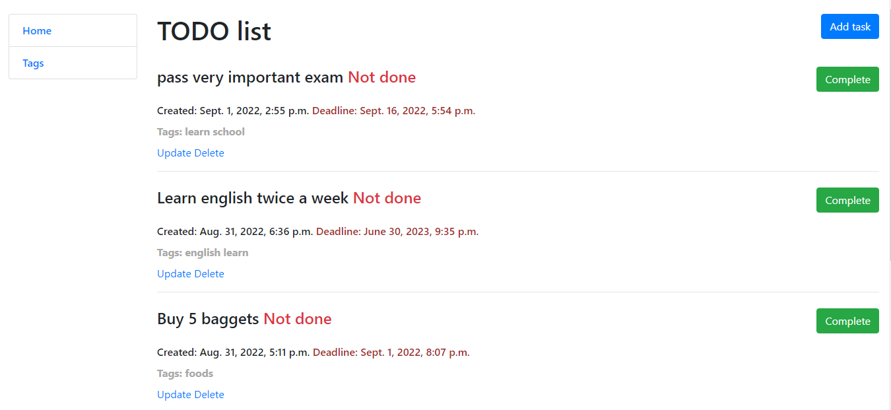
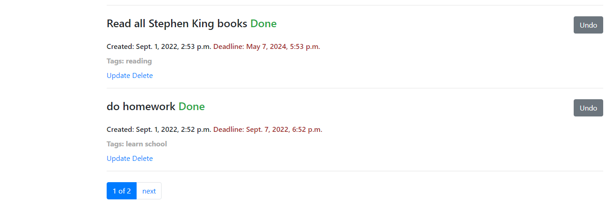

# TODO-LIST
Django project to help you remember to do everything you have planned

## Check it out!

[Taxi Service project on Heroku](https://taxi-service-2022.herokuapp.com/)

## Installation

Python must be already installed

```shell
git clone https://github.com/DanRoman-code/to-do-list
python3 -m venv venv
source venv/bin/activate (on Linux and macOS) or venv\Scripts\activate (on Windows)
pip install -r requirements.txt
python3 manage.py makemigrations
python3 manage.py migrate
python manage.py runserver
```

## Features

* Managing tasks
* Managing tags

## Demo



